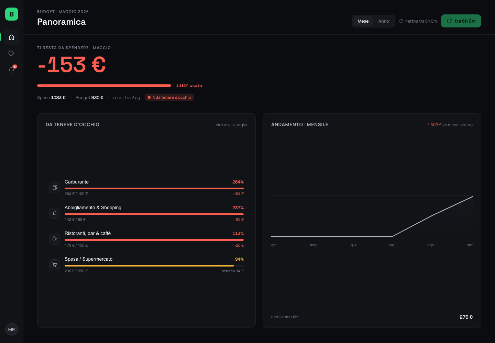
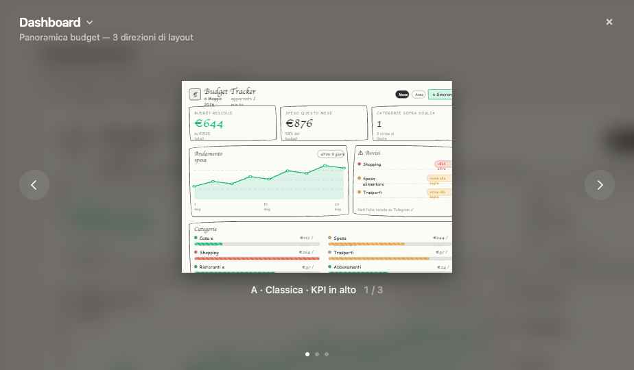

# Budget Tracker

App personale che importa i movimenti del conto via Open Banking (PSD2), li categorizza, li confronta con soglie mensili per categoria e manda una notifica quando una categoria si avvicina al limite o lo supera.



*Dati di esempio: il repository non contiene dati bancari reali.*

## In breve

| | |
|---|---|
| **Ruolo** | Product owner, designer e developer: requisiti e criteri di accettazione, modello dati e interfaccia, priorità degli incrementi, sviluppo tramite coding agent, test e accettazione |
| **Periodo** | maggio – luglio 2026 |
| **Stack** | Node.js e TypeScript, Express, PostgreSQL, React (prototipo senza build), `node:test` |
| **Integrazioni** | Enable Banking (Open Banking PSD2), API di Notion, notifiche macOS e Telegram |
| **Stato** | funzionante con un conto reale; progetto personale a utente singolo |

## L'obiettivo

Dal [documento di progetto](docs/documento-di-progetto-2026-05-31.pdf): importare in automatico le transazioni del conto, categorizzarle, confrontare la spesa con una soglia mensile per categoria e avvisare quando una categoria si avvicina al limite o lo supera.

Quattro requisiti non funzionali hanno guidato le scelte:

- nessuna transazione duplicata o persa;
- costo zero o minimo;
- dati bancari trattati solo in locale;
- regole di categorizzazione e soglie facili da modificare.

## Decisioni di prodotto

1. **Privacy prima della comodità.** Tutto gira sulla mia macchina: il server risponde solo in locale (`127.0.0.1`), il database è un Postgres locale e le notifiche sono quelle native di macOS. Passare a un database gestito come Supabase richiede solo di cambiare `DATABASE_URL`.
2. **Dall'aggregatore previsto a quello che funziona.** Il documento di progetto prevedeva Tink e scartava GoCardless, il cui piano gratuito era difficile da attivare. In implementazione il collegamento reale è passato a Enable Banking; l'integrazione Tink è rimasta uno stub.
3. **Categorie che imparano.** Enable Banking non fornisce categorie di spesa. La categorizzazione combina regole sul nome dell'esercente con le correzioni dell'utente: quando riassegno una transazione, l'app memorizza la regola e la applica a tutte le transazioni passate e future dello stesso esercente.
4. **Rispettare i limiti della banca.** Le API PSD2 consentono poche sincronizzazioni al giorno. La sincronizzazione all'avvio parte solo se l'ultima ha più di quattro ore, e l'interfaccia mostra quando sarà possibile la prossima.
5. **Notion come punto di correzione.** La sincronizzazione con Notion è bidirezionale, con una regola di proprietà per campo: l'app possiede importi, date e movimenti; Notion possiede categorie, budget e annotazioni manuali. Due fonti non scrivono mai sullo stesso campo, quindi non nascono conflitti.

## Dal wireframe all'interfaccia

L'interfaccia è passata da tre direzioni di layout in wireframe a una prima versione ad alta fedeltà, fino al redesign attuale (in alto).



## Architettura

La pipeline esegue in sequenza: import → deduplica → categorizzazione → aggregazione e soglie → notifiche.

Dipende solo da due interfacce, e questo la rende estensibile:

- **`TransactionSource`**, da dove arrivano i movimenti: dati finti, CSV o Enable Banking;
- **`Store`**, dove vengono salvati: in memoria o su Postgres.

Si cambia sorgente o database da variabile d'ambiente, senza toccare la pipeline. Il flusso funzionale completo è in [`docs/flusso-funzionale.png`](docs/flusso-funzionale.png).

## Provarlo in locale

Senza configurazione, con dati finti e senza database:

```bash
cd app
npm install
npm run run:demo   # pipeline completa, stampa la dashboard nel terminale
npm run dev        # dashboard web su http://localhost:3000
npm test           # 8 test
```

## Limiti

- Utente singolo, provato con una sola banca (Hype).
- L'interfaccia è un prototipo React caricato senza build; alcune etichette di periodo sono ancora statiche.
- Le cancellazioni fatte in Notion non si propagano all'app.
- Nessun deploy pubblico, per scelta: i dati bancari restano sulla macchina.

## Documenti

- [Documento di progetto](docs/documento-di-progetto-2026-05-31.pdf): analisi funzionale, architettura dell'informazione e architettura software. È la versione iniziale, basata su Tink.
- [Dettagli tecnici](app/README.md) · [Runbook](app/RUNBOOK.md) · [Istruzioni per i coding agent](app/CLAUDE.md)
